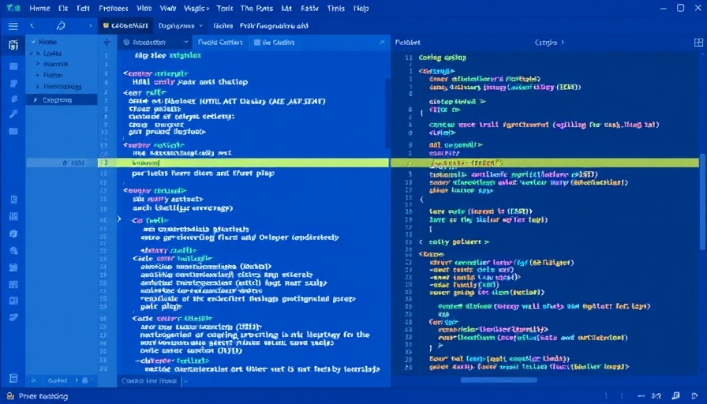
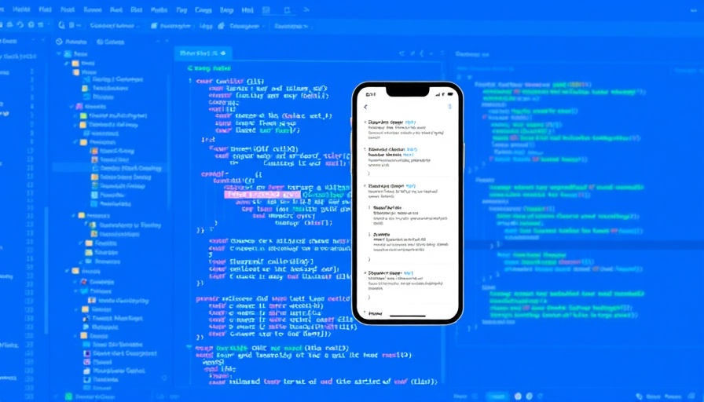

<html lang="en">
<head>
<meta charset="UTF-8">
<meta name="viewport" content="width=device-width, initial-scale=1.0">
<title>Code Club - Learn, Code, Create</title>

<link rel="preconnect" href="https://fonts.googleapis.com">
<link rel="preconnect" href="https://fonts.gstatic.com" crossorigin>
<link href="https://fonts.googleapis.com/css2?family=Pacifico&display=swap" rel="stylesheet">
<link href="https://fonts.googleapis.com/css2?family=Inter:wght@300;400;500;600;700&display=swap" rel="stylesheet">
<link rel="stylesheet" href="https://cdnjs.cloudflare.com/ajax/libs/remixicon/4.6.0/remixicon.min.css">

</head>
<body class="bg-white">
<!-- Navigation Bar -->
<nav class="fixed w-full top-0 z-50 bg-white bg-opacity-90 backdrop-blur-sm shadow-sm">

<a href="#" class="nav-link text-secondary font-medium cursor-pointer">Home</a>
<a href="#features" class="nav-link text-secondary font-medium cursor-pointer">Features</a>
<a href="#courses" class="nav-link text-secondary font-medium cursor-pointer">Courses</a>
<a href="#community" class="nav-link text-secondary font-medium cursor-pointer">Community</a>
<a href="#contact" class="nav-link text-secondary font-medium cursor-pointer">Contact</a>
<a href="#" class="bg-primary text-white px-5 py-2 !rounded-button font-medium hover:bg-opacity-90 transition-all cursor-pointer">Join Now</a>

<button id="mobile-menu-button" class="w-10 h-10 flex items-center justify-center cursor-pointer">
<i class="ri-menu-line ri-2x text-secondary"></i>
</button>

<!-- Mobile menu -->

<a href="#" class="block px-3 py-2 text-secondary font-medium hover:bg-primary hover:text-white !rounded-button cursor-pointer">Home</a>
<a href="#features" class="block px-3 py-2 text-secondary font-medium hover:bg-primary hover:text-white !rounded-button cursor-pointer">Features</a>
<a href="#courses" class="block px-3 py-2 text-secondary font-medium hover:bg-primary hover:text-white !rounded-button cursor-pointer">Courses</a>
<a href="#community" class="block px-3 py-2 text-secondary font-medium hover:bg-primary hover:text-white !rounded-button cursor-pointer">Community</a>
<a href="#contact" class="block px-3 py-2 text-secondary font-medium hover:bg-primary hover:text-white !rounded-button cursor-pointer">Contact</a>
<a href="#" class="block px-3 py-2 bg-primary text-white font-medium !rounded-button cursor-pointer">Join Now</a>

</nav>
<!-- Hero Section -->
<section class="relative overflow-hidden bg-secondary pt-24 pb-16">

<h1 class="text-4xl md:text-5xl font-bold text-white leading-tight mb-4">Welcome to Code Club</h1>

Where coding meets creativity. Join our community of developers and bring your ideas to life.

<a href="#" class="bg-primary text-white px-8 py-3 !rounded-button font-medium hover:bg-opacity-90 transition-all inline-block cursor-pointer">Get Started</a>
<a href="#courses" class="bg-white text-secondary px-8 py-3 !rounded-button font-medium hover:bg-gray-100 transition-all inline-block cursor-pointer">Explore Courses</a>

<!-- Floating code snippets -->

&lt;div&gt;

&lt;/&gt;

{ }

&lt;/&gt;

</section>
<!-- Stats Section -->
<section class="py-12 bg-white">

<h3 class="text-3xl font-bold text-secondary mb-2">20+</h3>

Active Members

<h3 class="text-3xl font-bold text-secondary mb-2">40+</h3>

Coding Courses

<h3 class="text-3xl font-bold text-secondary mb-2">98%</h3>

Success Rate

<h3 class="text-3xl font-bold text-secondary mb-2">24/7</h3>

Community Support

</section>
<!-- Features Section -->
<section id="features" class="py-16 bg-gray-50">

<h2 class="text-3xl md:text-4xl font-bold text-secondary mb-4">Why Choose Code Club?</h2>

We provide the tools, resources, and community support to help you master coding skills and advance your career.

<i class="ri-code-line ri-2x text-primary"></i>

<h3 class="text-xl font-semibold text-secondary mb-3">Expert-Led Courses</h3>

Learn from industry professionals with years of experience in software development and programming.

<i class="ri-group-line ri-2x text-primary"></i>

<h3 class="text-xl font-semibold text-secondary mb-3">Supportive Community</h3>

Connect with like-minded individuals, collaborate on projects, and grow together as developers.

<i class="ri-rocket-line ri-2x text-primary"></i>

<h3 class="text-xl font-semibold text-secondary mb-3">Career Advancement</h3>

Gain the skills and portfolio needed to land your dream job or advance in your current role.

<i class="ri-tools-line ri-2x text-primary"></i>

<h3 class="text-xl font-semibold text-secondary mb-3">Hands-On Projects</h3>

Build real-world applications and strengthen your portfolio with guided project-based learning.

<i class="ri-24-hours-line ri-2x text-primary"></i>

<h3 class="text-xl font-semibold text-secondary mb-3">Flexible Learning</h3>

Learn at your own pace with on-demand video lessons, exercises, and resources available 24/7.

<i class="ri-medal-line ri-2x text-primary"></i>

<h3 class="text-xl font-semibold text-secondary mb-3">Certification</h3>

Earn industry-recognized certificates to showcase your skills and expertise to employers.

</section>
<!-- Courses Section -->
<section id="courses" class="py-16 bg-white">

<h2 class="text-3xl md:text-4xl font-bold text-secondary mb-4">Popular Courses</h2>

Explore our most sought-after courses designed to help you master in-demand programming skills.

Beginner
8 weeks

<h3 class="text-xl font-semibold text-secondary mb-2">Full-Stack Web Development</h3>

Master HTML, CSS, JavaScript, React, Node.js, and MongoDB to build complete web applications.

$100
<a href="#" class="text-primary font-medium flex items-center cursor-pointer">
View Course <i class="ri-arrow-right-line ml-1"></i>
</a>

Intermediate
10 weeks

<h3 class="text-xl font-semibold text-secondary mb-2">Python for Data Science</h3>

Learn Python programming and essential libraries for data analysis, visualization, and machine learning.

$200
<a href="#" class="text-primary font-medium flex items-center cursor-pointer">
View Course <i class="ri-arrow-right-line ml-1"></i>
</a>

Advanced
12 weeks

<h3 class="text-xl font-semibold text-secondary mb-2">Mobile App Development</h3>

Build cross-platform mobile applications using React Native for iOS and Android platforms.

$299
<a href="#" class="text-primary font-medium flex items-center cursor-pointer">
View Course <i class="ri-arrow-right-line ml-1"></i>
</a>

<a href="#" class="bg-secondary text-white px-8 py-3 !rounded-button font-medium hover:bg-opacity-90 transition-all inline-block cursor-pointer">View All Courses</a>

</section>
<!-- Testimonials Section -->
<section class="py-16 bg-gray-50">

<h2 class="text-3xl md:text-4xl font-bold text-secondary mb-4">What Our Students Say</h2>

Hear from our community members who have transformed their careers through Code Club.

<h4 class="font-semibold text-secondary">Acema Innocent</h4>

Software Engineer at Glasco tech limited

<i class="ri-star-fill"></i>
<i class="ri-star-fill"></i>
<i class="ri-star-fill"></i>
<i class="ri-star-fill"></i>
<i class="ri-star-fill"></i>

"Code Club completely transformed my career. I went from knowing basic HTML to becoming a full-stack developer in just 6 months. The community support was incredible, and the instructors were always available to help."

<h4 class="font-semibold text-secondary">Mugambwa Augustine</h4>

Frontend Developer at Jessi Corp

<i class="ri-star-fill"></i>
<i class="ri-star-fill"></i>
<i class="ri-star-fill"></i>
<i class="ri-star-fill"></i>
<i class="ri-star-fill"></i>

"The project-based learning approach at Code Club was exactly what I needed. I built real applications that I could showcase in my portfolio, which ultimately helped me land my dream job at Netflix."

<h4 class="font-semibold text-secondary">Ouma Samuel</h4>

Data Scientist at Semitech

<i class="ri-star-fill"></i>
<i class="ri-star-fill"></i>
<i class="ri-star-fill"></i>
<i class="ri-star-fill"></i>
<i class="ri-star-half-fill"></i>

"As someone transitioning from a non-technical field, I was worried about keeping up. Code Club's structured curriculum and supportive community made learning Python and data science accessible and enjoyable."

</section>
<!-- Community Section -->
<section id="community" class="py-16 bg-white">

<h2 class="text-3xl md:text-4xl font-bold text-secondary mb-4">Join Our Global Community</h2>

Connect with over 20+ developers worldwide. Share knowledge, collaborate on projects, and grow together.

<ul class="space-y-4 mb-8">
<li class="flex items-start">

<i class="ri-check-line text-primary"></i>

Weekly coding challenges to sharpen your skills

</li>
<li class="flex items-start">

<i class="ri-check-line text-primary"></i>

Monthly hackathons with exciting prizes

</li>
<li class="flex items-start">

<i class="ri-check-line text-primary"></i>

Networking events with industry professionals

</li>
<li class="flex items-start">

<i class="ri-check-line text-primary"></i>

Job board with exclusive opportunities

</li>
</ul>
<a href="#" class="bg-primary text-white px-8 py-3 !rounded-button font-medium hover:bg-opacity-90 transition-all inline-block cursor-pointer">Join Community</a>

</section>
<!-- Newsletter Section -->
<section class="py-16 bg-secondary">

<h2 class="text-3xl font-bold text-white mb-4">Stay Updated with Code Club</h2>

Subscribe to our newsletter for the latest coding tutorials, industry news, and exclusive offers.

<form class="max-w-md mx-auto flex flex-col sm:flex-row gap-4">
<input type="email" placeholder="Enter your email" class="flex-grow px-4 py-3 !rounded-button focus:outline-none focus:ring-2 focus:ring-primary border-none">
<button type="submit" class="bg-primary text-white px-6 py-3 !rounded-button font-medium hover:bg-opacity-90 transition-all cursor-pointer">Subscribe</button>
</form>

</section>
<!-- Contact Section -->
<section id="contact" class="py-16 bg-white">

<h2 class="text-3xl md:text-4xl font-bold text-secondary mb-4">Get in Touch</h2>

Have questions or need more information? Reach out to our team and we'll get back to you as soon as possible.

<form class="space-y-6">

<label for="name" class="block text-sm font-medium text-gray-700 mb-1">Full Name</label>
<input type="text" id="name" class="w-full px-4 py-3 !rounded-button border border-gray-300 focus:outline-none focus:ring-2 focus:ring-primary focus:border-transparent">

<label for="email" class="block text-sm font-medium text-gray-700 mb-1">Email Address</label>
<input type="email" id="email" class="w-full px-4 py-3 !rounded-button border border-gray-300 focus:outline-none focus:ring-2 focus:ring-primary focus:border-transparent">

<label for="subject" class="block text-sm font-medium text-gray-700 mb-1">Subject</label>
<input type="text" id="subject" class="w-full px-4 py-3 !rounded-button border border-gray-300 focus:outline-none focus:ring-2 focus:ring-primary focus:border-transparent">

<label for="message" class="block text-sm font-medium text-gray-700 mb-1">Message</label>
<textarea id="message" rows="5" class="w-full px-4 py-3 !rounded-button border border-gray-300 focus:outline-none focus:ring-2 focus:ring-primary focus:border-transparent"></textarea>

<button type="submit" class="w-full bg-primary text-white px-6 py-3 !rounded-button font-medium hover:bg-opacity-90 transition-all cursor-pointer">Send Message</button>
</form>

<h3 class="text-xl font-semibold text-secondary mb-6">Contact Information</h3>

<i class="ri-map-pin-line text-primary"></i>

<h4 class="font-medium text-secondary mb-1">Location</h4>

Uganda, Kampala, keybando, kyebendo kisalosalo

<i class="ri-mail-line text-primary"></i>

<h4 class="font-medium text-secondary mb-1">Email</h4>

info@codeclub.com

<i class="ri-phone-line text-primary"></i>

<h4 class="font-medium text-secondary mb-1">Phone</h4>

+(256) 785801062

<i class="ri-time-line text-primary"></i>

<h4 class="font-medium text-secondary mb-1">Working Hours</h4>

Monday - Friday: 9:00 AM - 6:00 PM

<h4 class="font-medium text-secondary mb-4">Follow Us</h4>

<a href="#" class="w-10 h-10 flex items-center justify-center bg-primary bg-opacity-10 rounded-full hover:bg-primary hover:text-white transition-all cursor-pointer">
<i class="ri-facebook-fill"></i>
</a>
<a href="#" class="w-10 h-10 flex items-center justify-center bg-primary bg-opacity-10 rounded-full hover:bg-primary hover:text-white transition-all cursor-pointer">
<i class="ri-twitter-fill"></i>
</a>
<a href="#" class="w-10 h-10 flex items-center justify-center bg-primary bg-opacity-10 rounded-full hover:bg-primary hover:text-white transition-all cursor-pointer">
<i class="ri-linkedin-fill"></i>
</a>
<a href="#" class="w-10 h-10 flex items-center justify-center bg-primary bg-opacity-10 rounded-full hover:bg-primary hover:text-white transition-all cursor-pointer">
<i class="ri-github-fill"></i>
</a>

</section>
<!-- Footer -->
<footer class="bg-secondary text-white py-12">

Empowering developers to build the future through code.

<a href="#" class="text-gray-300 hover:text-primary transition-colors cursor-pointer">
<i class="ri-facebook-fill"></i>
</a>
<a href="#" class="text-gray-300 hover:text-primary transition-colors cursor-pointer">
<i class="ri-twitter-fill"></i>
</a>
<a href="#" class="text-gray-300 hover:text-primary transition-colors cursor-pointer">
<i class="ri-linkedin-fill"></i>
</a>
<a href="#" class="text-gray-300 hover:text-primary transition-colors cursor-pointer">
<i class="ri-github-fill"></i>
</a>

<h4 class="text-lg font-semibold mb-4">Quick Links</h4>
<ul class="space-y-2">
<li><a href="#" class="text-gray-300 hover:text-primary transition-colors cursor-pointer">Home</a></li>
<li><a href="#" class="text-gray-300 hover:text-primary transition-colors cursor-pointer">About us</a></li>
<li><a href="#" class="text-gray-300 hover:text-primary transition-colors cursor-pointer">Courses</a></li>
<li><a href="#community" class="text-gray-300 hover:text-primary transition-colors cursor-pointer">Community</a></li>
<li><a href="#" class="text-gray-300 hover:text-primary transition-colors cursor-pointer">Contact</a></li>
</ul>

<h4 class="text-lg font-semibold mb-4">Resources</h4>
<ul class="space-y-2">
<li><a href="#" class="text-gray-300 hover:text-primary transition-colors cursor-pointer">Blog</a></li>
<li><a href="#" class="text-gray-300 hover:text-primary transition-colors cursor-pointer">Documentation</a></li>
<li><a href="#" class="text-gray-300 hover:text-primary transition-colors cursor-pointer">Tutorials</a></li>
<li><a href="#" class="text-gray-300 hover:text-primary transition-colors cursor-pointer">FAQs</a></li>
<li><a href="#" class="text-gray-300 hover:text-primary transition-colors cursor-pointer">Support</a></li>
</ul>

<h4 class="text-lg font-semibold mb-4">Legal</h4>
<ul class="space-y-2">
<li><a href="#" class="text-gray-300 hover:text-primary transition-colors cursor-pointer">Terms of Service</a></li>
<li><a href="#" class="text-gray-300 hover:text-primary transition-colors cursor-pointer">Privacy Policy</a></li>
<li><a href="#" class="text-gray-300 hover:text-primary transition-colors cursor-pointer">Cookie Policy</a></li>
<li><a href="#" class="text-gray-300 hover:text-primary transition-colors cursor-pointer">Refund Policy</a></li>
</ul>

© 2025 Code Club. All rights reserved.

</footer>
<!-- Back to Top Button -->
<button id="back-to-top" class="fixed bottom-8 right-8 bg-primary text-white w-12 h-12 rounded-full flex items-center justify-center shadow-lg opacity-0 invisible transition-all z-50 cursor-pointer">
<i class="ri-arrow-up-line ri-lg"></i>
</button>

</body>
</html>
